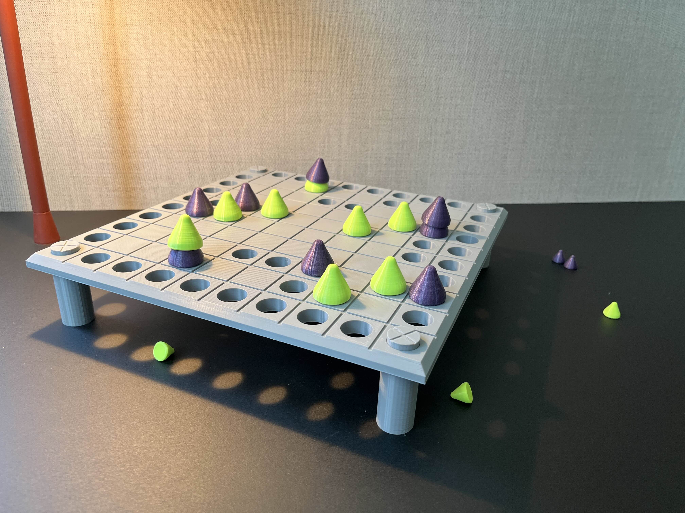

tecnical intro for essom, names mechanics etc.

☽ ☼ ☾

The word Essom is the recalling of a word I heard once, which was surely not Essom. I forgot how the word really sounded, how it was spelled, and even from which language it came; just the meaning stayed with me. This un-remembered word was used to name the place where all lost things go, and this is the meaning I give to this new chimera: Essom. I guess the real one, is probably at Essom right now.

---

  
  
  

---

In the game, Essom could be the board under the board: that shadow that is cast by board, and where small Sils fall when Tsoas are pushed to holes. Or on a second thought it could also be the area under the Tsoas, where Sils are hidden. Somehow both views are valid. Players search for Sils, but at the same time, they are also the ones that keep them hidden. So when are they really lost? This duality is probably the heart of the heart for Essom.

---

“Why do Tsoas hide Sils of the opposite color?”- someone asks. 
“To me, Sils hidden under Tsoas reminds me of a child hiding behind a mother's lap. Maybe it's just that the mother is not the right one”- other answers. 

---

Above all, I think Tsoas and Sils are symbols of families that were broken, and families that need to be broken so identities can be restored. Essom represent the outcome of decisions that were made from a position of fear and hatred. The result of a military dictatorship. The struggle of the human rights organization “Abuelas de Plaza de Mayo”, and the search for identity of a stolen generation.

☾ ☼ ☽

It's a game that offers tactical depth, yet it is not a coincidence that memory is such a crucial element of gameplay. Remembering or forgetting where Sils are hidden is the grounding point for all possible strategies. Hiding, protecting or searching, the focus is always put on Sils.

☽ ☼ ☾

I was surprised to notice that in a way Sils are stripped of its identity two times. The obvious one: when they are hidden for the first time. But also it also happens, when they are found, for a small act of violence is needed to push a Tsoa to a hole, and let the Sil fall off the board. This portrays the complexity of the situation these families were put in.

<iframe src="https://drive.google.com/file/d/1grMPTFva3qjMSKzPUWEm8MeUwoDNK63h/preview" width="640" height="720" style="border:3px solid grey;" allow="autoplay"></iframe>

Essom won [Best Game Design](https://game.speldesign.uu.se/projects/analog-games/essom/) at the Gotland Game Conference 2025. Thanks to this recognition, it received funding to go to Spiel Essen 2025. Although the game is especially fun in its analog version, a [Steam Workshop](https://steamcommunity.com/sharedfiles/filedetails/?id=3546913194 "Visit the Steam Workshop") on Tabletop Simulator is also available, showcasing a digital adaptation of the game.

   
  
   

☽ ~~~~~  ☾ ☼ ☽  ~~~~~ ☾

