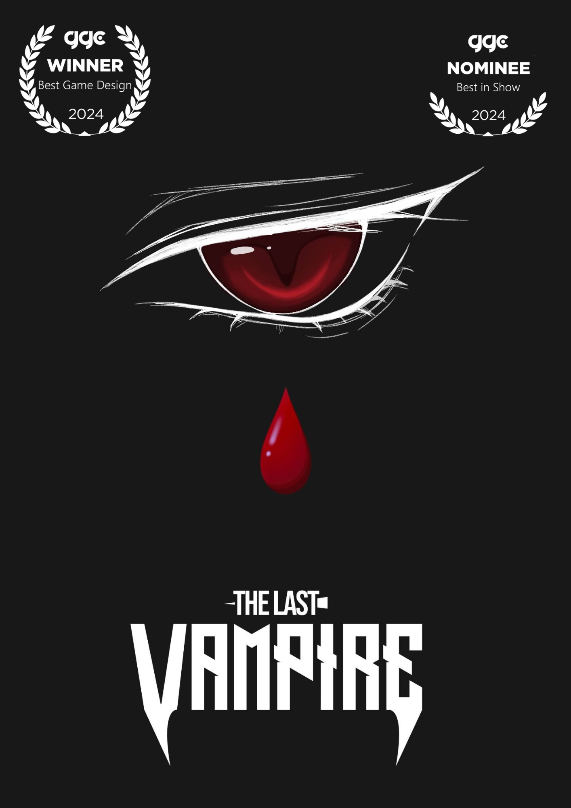
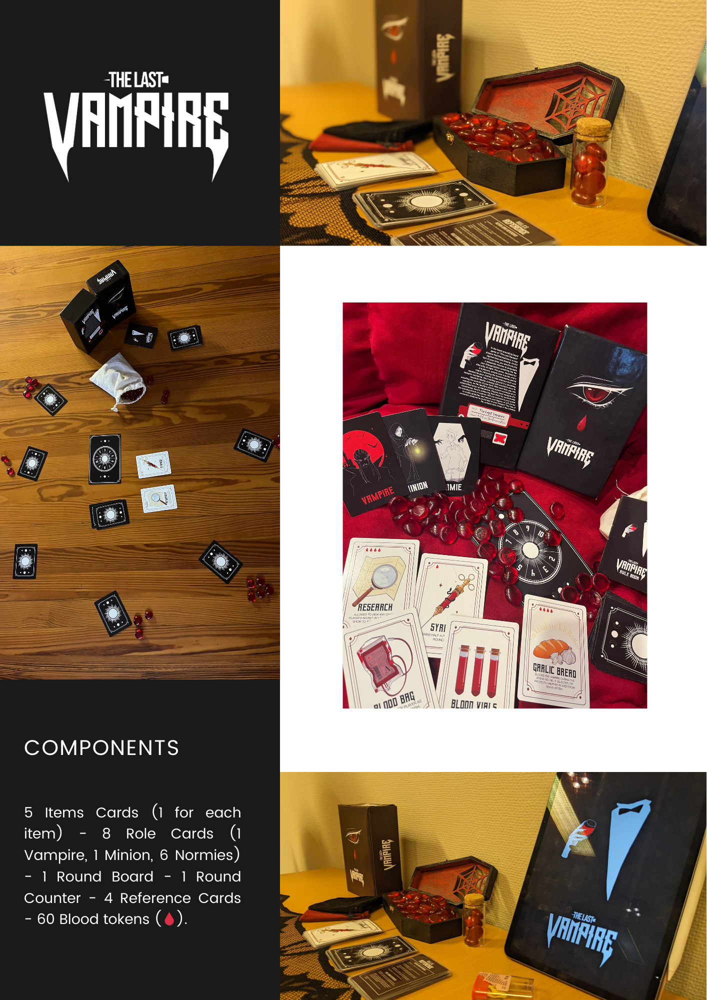

   
  
  
   

The Last Vampire was the outcome of a group project and the first full-fledged game I ever made. I had the chance to watch a lot of people playing it, and the fact that it’s always such a fun experience makes me especially proud. I like to think that the fun players can get out of a game relates to how fun the design process was in itself.

For me, games that “spark joy” (as Marie Kondo would say) usually come from playful design experiences. The Last Vampire was exactly that: without noticing, we ended up having a lot of fun when making it, and that reflects in the game.

Funny to think that, without even noticing, we hit on one of game design’s golden rules; one that seems often neglected in games nowadays. Of course, I am not suggesting that just having fun is enough to create a great game, but from a design perspective, it feels like the only possible starting point.

🩸🩸🩸🩸

The Last Vampire won <a href="https://game.speldesign.uu.se/projects/analog-games/the-last-vampire/" target="_blank" rel="noopener noreferrer">Best Game Design</a> at the Gotland Game Conference 2024, was also nominated for Best in Show, and received funding to attend Spiel Essen 2025. Although the game is especially fun in its analog version, a <a href="https://steamcommunity.com/sharedfiles/filedetails/?id=3551316320" target="_blank" rel="noopener noreferrer" title="Visit Steam">Steam Workshop</a> on Tabletop Simulator is also available. Furthermore, it has been used as a case study for research in both psychology and <a href="https://uu.diva-portal.org/smash/record.jsf?pid=diva2%3A1874280&dswid=-253" target="_blank" rel="noopener noreferrer" title="Visit DiVA">Game Design</a> by Uppsala University.

  <iframe src="https://drive.google.com/file/d/1DIjEQL46iLtv-yWAjoD9MBq4nvIJfo9f/preview" width="640" height="720" allow="autoplay"></iframe>
   

From a design perspective, The Last Vampire tackles crucial aspects of social deduction games. A key feature is that the focus is not put on roles, but on items instead. This simple shift not only distributes agency more evenly among players but also allows agency to shift throughout gameplay, something that fixed roles cannot offer.

More importantly, players’ interaction with items, and, as an extension, with blood resources, was specially designed to foster social interaction and give players space to discuss, talk, doubt, deduce, and deceive. What is more, in contrast to player elimination, players can be muted by turns throughout the game. This small adjustment enhances not only the experience of the muted player but also the engagement of the whole group.

The game features fast and minimal setup, easy-to-remember rules, and lets complexity emerge naturally through twists of arguments, layers of intention, or disguised motives. In the end, it’s the players themselves who bring the complexity and replayability to the game.

  <iframe width="560" height="315" src="https://www.youtube.com/embed/DBZz-ncnevk?si=_5B6BWH2y8VWxiys" title="YouTube video player" frameborder="0" allow="accelerometer; autoplay; clipboard-write; encrypted-media; gyroscope; picture-in-picture; web-share" referrerpolicy="strict-origin-when-cross-origin" allowfullscreen></iframe>

 
Thanks for getting here, even if you just scroll down  -.<

