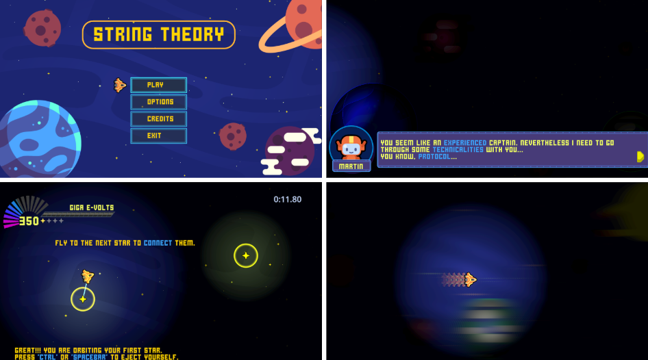
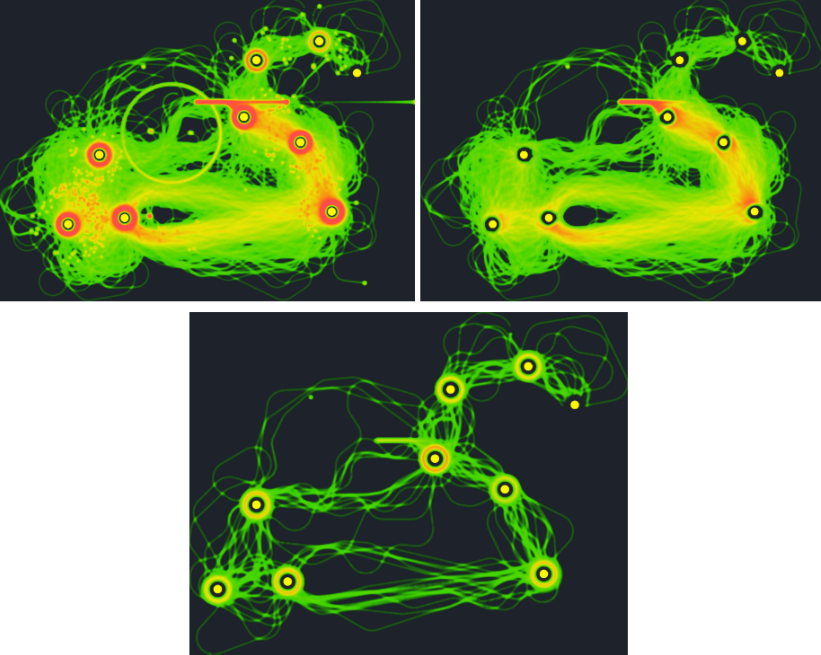
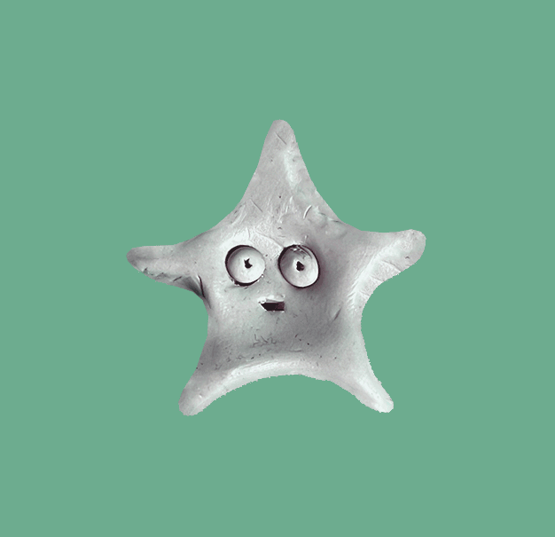

  

String Theory is an action-puzzle, top-down 2D space game where players maneuver a spaceship that traverses the sky’s constellations. Each level represents one of the twelve zodiac constellations, and the goal is to draw each constellation by connecting its given stars. Sounds simple and straightforward, right? But maybe not quite…

⭐<code><a href="https://drive.google.com/drive/folders/1YpS6nY7ej0Vf_0qD2wnZ66WQ_0eMDCPw" target="_blank" rel="noopener noreferrer">A Windows build is available for download</a>.</code>⭐ ⭐

Through gameplay the ship alternates between two states: orbiting stars, which recharge its engine with gravitational energy, and free flight, which consumes energy. Players must balance energy usage, timing of ejection from orbits, and strategic path choices to avoid all obstacles. In this way, quick reactions, fast decision-making and energy management become central components of the game.

⭐

String Theory is a fast-paced game where difficulty quickly spikes. As players are rushed through levels, repeated failure becomes an inevitable part of the experience. Conversely, repeated attempts are also encouraged aiming to foster a sense of perseverance.

⭐

Overall, we aimed to nurture players’ frustration as gameplay unfolds and to explore how far we could push it. Frustration is such a crucial and interesting element that all games need to address. If it is not carefully tailored, it can lead to a negative emotional impact on players and foster disengagement. Yet frustration is not inherently negative: it can also be used as a tool to fine-tune players’ interests and enhance emotional investment, as long as they can feel a sense of progress despite setbacks.

  <iframe src="https://drive.google.com/file/d/1Ei_piX66B7IYlXH_iWGcYHz8CxF6X3gB/preview" width="100%" height="auto" style="aspect-ratio: 16 / 9;" allow="autoplay"></iframe>

Moreover, String Theory has served as a case study, resulting in a <a href="https://uu.diva-portal.org/smash/record.jsf?pid=diva2%3A1965699&dswid=3547" target="_blank" rel="noopener noreferrer" title="Visit DiVA">Publication</a> that explores how distinct in-game behaviours vary based on players’ self-reported intrinsic motivations and challenge types preferences. To investigate this, diverse in-game data were collected and analyzed to identify behavioral patterns.

  <i>View of Heatmaps for a level: Leo Constellation</i>

  

We can say we were lucky enough to see a lot of people play the game. It's not a game for everyone, but we notice that for its target audience the game has a very good retention rate, and players keep coming back to it. Currently, we are refining its game play, mainly to fine tune the game flow since it's such a crucial aspect when you are dealing with high frustration games. At the same time we are taking this opportunity to migrate its art asset, since the plan is to make it on clay.

  

⭐⭐

